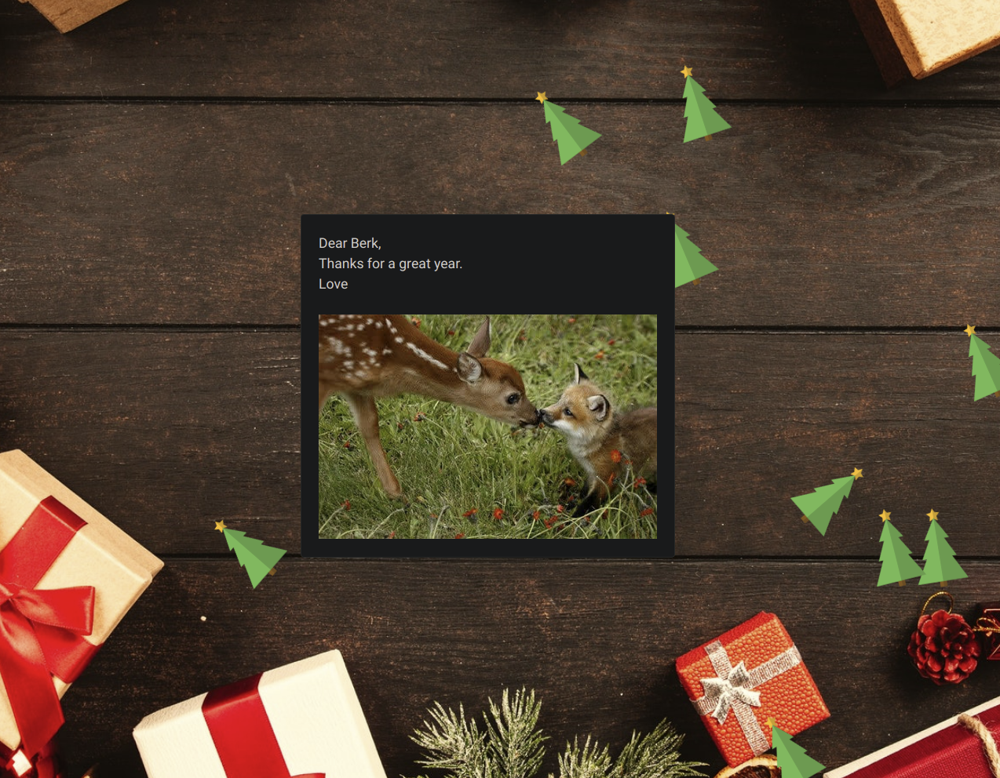

# Gift Website
This website is a more exciting way to send letters digitally than 
simply sending emails with long boring text. With the Gift Website, 
there are customizable backgrounds, multiple logins, and even confetti!

## Creating your own Gift Website
To create your own Gift Website, fork this repo, clone it locally, 
run ``npm install``, customize your occasions, add a ``firebase.json`` file 
and set up a firebase backend. Use Email auth for users, firestore, 
and storage. For firestore, make a collection named users and documents 
with each users UID as the name. Then add a message field and occasion 
field. Write your message as if it were in a ``
`` tag (using `` `` 
for carriage returns). For the photos, create a folder with each 
users UID and add an image named image.jpg into it. Finally, make sure 
the website is properly deployed based on gh pages (follow [this 
guide](https://dev.to/yuribenjamin/how-to-deploy-react-app-in-github-pages-2a1f) if stuck)

## Adding a new occasion
- In the occasions folder, add a new css, js, background, and confetti file. 
- Edit the new files to your liking.
- Fix the router in the ``app.js`` file.
- Check the occasion field in your firestore documents.

## Software Used:
- React Js
- Firebase
- React-Bootstrap
- React-Router

## Commands
``npm start`` for testing localhost
``npm run deploy`` to deploy to gh-pages 
